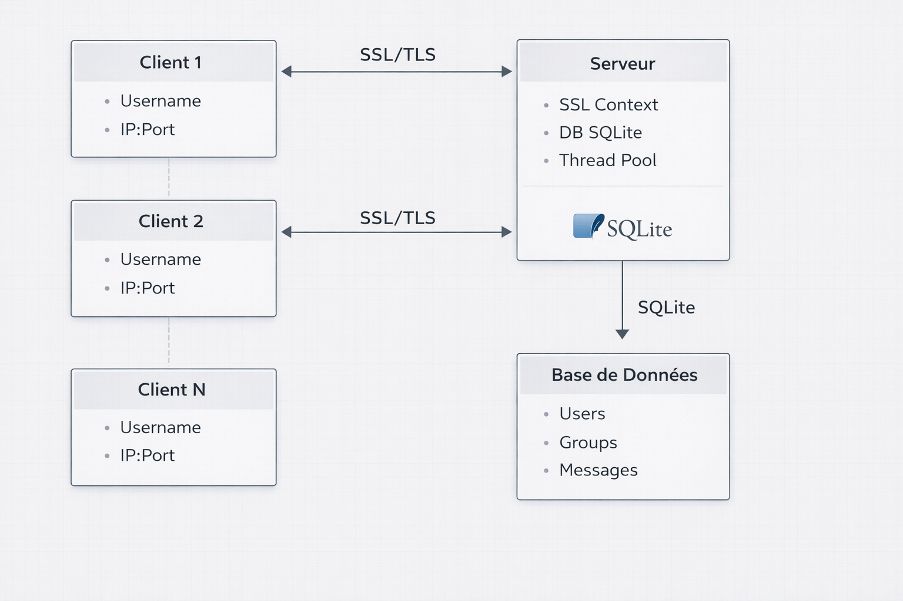

# Chat SSL

Ce projet est une application de chat sécurisée utilisant SSL pour la communication entre clients et serveur.

## Architecture

L'architecture du projet est basée sur un modèle client-serveur. Le serveur gère les connexions des clients, l'authentification, et la transmission des messages. Les clients se connectent au serveur via une connexion SSL sécurisée.



## Fonctionnalités

- Authentification des utilisateurs
- Messagerie de groupe et privée
- Commandes pour rejoindre/quitter des groupes
- Liste des utilisateurs et groupes actifs
- Communication chiffrée via SSL
- Commandes rapides :
  - `/g <message>` : envoyer un message au groupe
  - `/p <utilisateur> <message>` : envoyer un message privé
  - `/h` : afficher l'aide
  - `/q` : quitter

## Demo

https://github.com/user-attachments/assets/01ab2e71-fa64-411b-b30b-d43fc02f0f42

## Fichiers principaux

- `server_ssl.c` : serveur de chat SSL
- `client_ssl.c` : client de chat SSL
- `users.sql` : script SQL pour la gestion des utilisateurs
- `Makefile` : compilation
- `deploy.sh` : script de déploiement
- `test_chat.sh` : script de test

## Installation des dépendances sur CentOS

```sh
# CentOS 7/8
sudo yum update -y

# Installer les outils de développement
sudo yum groupinstall "Development Tools" -y
sudo yum install openssl-devel sqlite-devel -y

# Pour CentOS 8 (si sqlite-devel n'est pas disponible)
sudo dnf install sqlite-devel openssl-devel gcc make -y
```

## Compilation

```sh
make
```

## Cetifications

```sh
make certificates
```

## Firewall

```sh
make firewall
```

## Lancement du serveur

```sh
./server_ssl
```

## Lancement du client

```sh
./client_ssl
```

## Alternative: Use ssldump instead of Wireshark:

```bash
# Install ssldump
sudo yum install ssldump  # or sudo apt-get install ssldump

# Capture and decode TLS
sudo ssldump -i lo -d port 8888

```

## Dépendances

- OpenSSL
- pthread
- sqlite3
